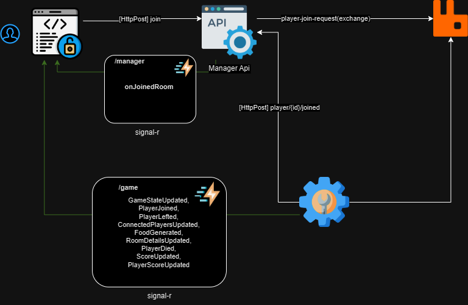

# Snake Game
Yet another snake game, but it's multiplayer!

As my developing years go by, I noticed that I've never developed a portfolio project that could be shown to someone. 

So I decided to create this project to show some of my skills and knowledge in software development.

This project gathers some of the technologies that I've worked in the past, to create a simple multiplayer snake game.


# Controls 

- **Arrow Keys** - Move the snake
- **Space** - Shoot a bullet (if you have bullets, which can be aquired eating foods)
- **A,W,S,D** - Move the snake

# Technologies

- [.NET 8](https://learn.microsoft.com/en-us/dotnet/core/whats-new/dotnet-8/overview)
- [Angular 17](https://angular.io/docs)
- [RabbitMQ](https://www.rabbitmq.com/docs)
- [SignalR](https://learn.microsoft.com/pt-br/aspnet/core/signalr/introduction?view=aspnetcore-8.0&WT.mc_id=dotnet-35129-website)
- [Docker](https://docs.docker.com/get-started/overview/)
- [Docker Compose](https://docs.docker.com/compose/)


# Architecture
The project is divided into 3 main parts:

- [Ui](#ui)
- [Manager Api](#manager-api)
- [Game Server](#game-server)




# Demo

I don't know how long the demo will be available, but you can check it out [here](https://snake.game.andrades.cloud/)


# Docker Images

The project has 3 main docker images:

|   **app**   |                          **image**                           |   version    |
| :---------: | :----------------------------------------------------------: | :----------: |
|   angular   | registry.codescovery.com/dev-vinicius-andrade/snake-game/application/ui/angular | 1.0.0,latest |
| manager-api | registry.codescovery.com/dev-vinicius-andrade/snake-game/application/manager/api | 1.0.0,latest |
| game-server | registry.codescovery.com/dev-vinicius-andrade/snake-game/application/game/server | 1.0.0,latest |


# Ui

Currently the game has the following UIs:

- [Angular](#ui-angular)


## UI Angular

The angular app is an User Interface to play a multiplayer Snake Game

It provides a way to connect to a running server using SignalR and REST Apis.

Checkout the angular app [docs](https://github.com/dev-vinicius-andrade/snake-game/blob/main/src/Application/Application.Ui.Angular/README.md)

# Game Server

The game server is responsible to handle the game state. 

As the main idea is to be able to bootstrap as many game servers you want, the game server connects to a [RabbitMq](https://www.rabbitmq.com/docs) [Queue](https://www.rabbitmq.com/docs/queues) *binded* to [player-join-request(exchange)](https://www.rabbitmq.com/docs/publishers), checks if there's an available room to the player connects, if not it requeue the message to other server try to handle it.

If there is an available space in server it sends a request to the [Manager Api](#manager-api) which will notify the ui-client the server data to connect.

Game server is also responsible to management the game state of each room, like the snake position, food position, and the game logic.

From time to time the game server generates a new food in the game room if the food count is less than the maximum food count.

Also, the game server is responsible to handle the collisions between the snakes and the foods, or obstacles.

## Game Server Configurations
All the configurations available are on [appSettings.json](https://github.com/dev-vinicius-andrade/snake-game/blob/main/src/Application/Application.Game.Server/Configurations/appsettings.json)

But the main ones are:

```json
{
    //...
	"AppSettings": {
        //...
        "EventbusConfiguration": {
          "ConnectionString": "amqp://rabbitmq:5672"
        },
        "ManagementApiConfiguration": {
          "BaseUrl": "https://Application.Manager.Api",
          "ApiKey": "E1F7F301-B9DD-4CE0-A4FF-85DC46B3624D"

        },
        //...
	},
  	"ServerConfiguration": {
        "Domain": "localhost",
        "Scheme": "https",
        "Path": null,
        "RoomsConfiguration": {
          "MaxRooms": 2,
          "MaxPlayersPerRoom": 5,
          "MaxFoods": 50,
          "Width": 1920,
          "Height": 1080
        },
        "FoodConfiguration": {
          "FoodGenerationInterval": 50,
          "FoodSize": 15
        },
        "SnakeConfiguration": {
          "RotationSpeed": 5,
          "Speed": 15,
          "HeadSize": 15,
          "InitialSnakeSize": 5
        }
    //...
}
```

All the variables can be overwritten using the .net app settings environment variables [pattern](https://learn.microsoft.com/en-us/aspnet/core/fundamentals/configuration/?view=aspnetcore-8.0)

### Game Server Notes

Currently the Api Key is configured in the appsettings.json file, but it's not recommended to store sensitive data in the appsettings.json file.
But for the sake of simplicity, I've added it there just to show how it works.

## Running Game Server

To run the game server you can use the following command:

```bash
cd src/Application/Application.Game.Server && \
dotnet run --project Application.Game.Server.csproj
```

## Running Game Server with Docker

To run the game server with docker you can use the following command:

```bash
	cd src/Application/Application.Game.Server && \
	docker build -t game-server . && \
	docker run -p 5000:80  
	-e AppSettings__EventbusConfiguration__ConnectionString="{RABBITMQ_URI}" \
	-e AppSettings__ManagementApiConfiguration__ApiKey="{DESIRED_API_KEY}" \
	-e AppSettings__ManagementApiConfiguration_BaseUrl="{MANAGEMENT_API_BASE_URL}" \
    -e ServerConfiguration__Domain=localhost \
    -e ServerConfiguration__Scheme=http \
    -e ServerConfiguration__Port=80 \
	game-server
```


# Manager Api

It is responsible to be the middleware between the client and the [server](#game-server).

When a server successfully notified the manager that the player can connect to it, it sends a notification through [SignalR](https://learn.microsoft.com/pt-br/aspnet/core/signalr/introduction?view=aspnetcore-8.0&WT.mc_id=dotnet-35129-website) with the **game-server data** which will be used by the player to connect.

## Manager Api Configurations

All the configurations available are on [appSettings.json](https://github.com/dev-vinicius-andrade/snake-game/blob/main/src/Application/Application.Manager.Api/Configurations/appsettings.json)

But the main ones are:

```json
{
    "AppSettings": {
    	//...
        "EventbusConfiguration": {
          "ConnectionString": "amqp://rabbitmq:5672"
        }
        //...
    },
  	"AuthConfiguration": {
        "ApiKeys": [
          "E1F7F301-B9DD-4CE0-A4FF-85DC46B3624D"
        ]
  },
}

```

All the variables can be overwritten using the .net app settings environment variables [pattern]([Configuration in ASP.NET Core | Microsoft Learn](https://learn.microsoft.com/en-us/aspnet/core/fundamentals/configuration/?view=aspnetcore-8.0))


### Manager Api Notes

Currently the Api Key is configured in the appsettings.json file, but it's not recommended to store sensitive data in the appsettings.json file.
But for the sake of simplicity, I've added it there just to show how it works.

## Running Manager Api

To run the manager api you can use the following command:

```bash
cd src/Application/Application.Manager.Api && \
dotnet run --project Application.Manager.Api.csproj
```

## Running Manger Api with Docker

To run the manager api with docker you can use the following command:

```bash
    cd src/Application/Application.Manager.Api && \
    docker build -t manager-api . && \
    docker run -p 5000:80  
    -e AppSettings__EventbusConfiguration__ConnectionString="{RABBITMQ_URI}" \
    -e AuthConfiguration__ApiKeys__0="{DESIRED_API_KEY}" \
    manager-api
```


# Docker Compose

You can run the whole project using docker-compose. 

- [Docker Compose Example](#docker-compose-example)
- [Docker Compose Visual Studio](#docker-compose-visual-studio)


## Docker Compose Example

To run the whole project you can use the following docker-compose file:

```yaml
version: '3.9'
name: snake-game
services:
  application.manager.api:
    image: registry.codescovery.com/dev-vinicius-andrade/snake-game/application/manager/api
    container_name: 'application.manager.api'
    networks:
      - snake-game-net
      # - local ## Checkout the docs to see more about what is the local network and why use it
    # ports:
      # - "60510:80"
      # - "60511:443"
    environment:
        - ASPNETCORE_URLS=http://+:80
    depends_on:
        redis:
          condition: service_healthy
        rabbitmq:
          condition: service_healthy
    # profiles:
        # - server-core-plus-local-enviroment
        # - server-core
        # - server-core-plus-ui-angular
        # - server-core-plus-local-enviroment-plus-ui-angular          
  application.game.server:
    image: registry.codescovery.com/dev-vinicius-andrade/snake-game/application/game/server
    container_name: 'application.game.server'
    depends_on:
      application.manager.api:
        condition: service_started
    networks:
      - snake-game-net
      # - local ## Checkout the docs to see more about what is the local network and why use it
    # ports:
      # - "60520:80"
      # - "60521:443"
    environment:
        - ASPNETCORE_URLS=http://+:80
        - AppSettings__ManagementApiConfiguration_BaseUrl=http://localhost:60510
        - ServerConfiguration__Domain=localhost
        - ServerConfiguration__Scheme=http
        - ServerConfiguration__Port=80
    # profiles:
        # - server-core-plus-local-enviroment
        # - server-core
        # - server-core-plus-ui-angular
        # - server-core-plus-local-enviroment-plus-ui-angular  
  application.ui.angular:
    image: registry.codescovery.com/dev-vinicius-andrade/snake-game/application/ui/angular
    container_name: 'application.ui.angular'
    build:
      context: Application/Application.Ui.Angular
      dockerfile: Dockerfile
    depends_on:
      application.manager.api:
        condition: service_started
      application.game.server:
        condition: service_started
     # profiles:
        # - ui-angular
        # - server-core-plus-ui-angular
        # - server-core-plus-local-enviroment-plus-ui-angular
    networks:
      - snake-game-net
      # - local ## Checkout the docs to see more about what is the local network and why use it
    # ports:
      # - "4200:80"
    environment:
      INTEGRATIONS_API_MANAGER_BASEURL: http://localhost:60510
      
  redis:
    hostname: redis
    container_name: 'redis'
    image: redis
    # profiles:
        # - local-enviroment
        # - server-core-plus-local-enviroment
        # - server-core-plus-local-enviroment-plus-ui-angular
    healthcheck:
      test: [ "CMD", "redis-cli", "--raw", "incr", "ping" ]
    networks:
      - snake-game-net
      # - local ## Checkout the docs to see more about what is the local network and why use it
  rabbitmq:
    image: rabbitmq:management
    container_name: 'rabbitmq'
    healthcheck:
      test: rabbitmq-diagnostics -q ping
      interval: 30s
      timeout: 30s
      retries: 3
    # profiles:
        # - local-enviroment
        # - server-core-plus-local-enviroment
        # - server-core-plus-local-enviroment-plus-ui-angular
    networks:
      - snake-game-net
      # - local ## Checkout the docs to see more about what is the local network and why use it
networks:
  snake-game-net:
    driver: bridge
  # local: ## Checkout the docs to see more about what is the local network and why use it
    # external: true ## Checkout the docs to see more about what is the local network and why use it

```

> If you want to expose the ports to the host machine, you can uncomment the ports section in the services you want to expose the ports.
>
> Don't forget to change the environment variables to reflect the ports you want.

### Docker Compose Example Profiles

As you noticed, there are some commented profiles in the docker-compose file. You can use them to run the project in different ways.

| Profile | Description |
|---------|-------------|
| server-core-plus-local-enviroment     | Runs the server core(Application.Game.Server, Application.Manager.Api) and local environment services |
| server-core     | Runs the server core(Application.Game.Server, Application.Manager.Api) |
| server-core-plus-ui-angular     | Runs the server core(Application.Game.Server, Application.Manager.Api) and the ui-angular |
| server-core-plus-local-enviroment-plus-ui-angular     | Runs the server core(Application.Game.Server, Application.Manager.Api) and the ui-angular and local environment services |
| ui-angular     | Runs the ui-angular |
| local-enviroment     | Runs the local environment services |

To run the project using the profiles you need:
- Uncomment the profile you want to run in the services you want to run with the profile.
- Run the docker-compose file with the profile you want to run.

```bash
docker-compose  -f docker-compose.yml --profile <YOUR_DESIRED_PROFILE_NAME> up
```

### Docker Compose Example with Local Network

If you plan to run this docker-compose file in a different docker-compose which will reference the services in this docker-compose file, you can use the local network to connect the services.

- First, create a docker network with the name you want, in this example I'll use the name **'local'**:
        `docker network create local`
- Then, uncomment the local network in the services you want to connect to the local network.

- Add the same uncommented local network in the networks section of your other docker-compose file.

- Run both docker-compose projects.


## Docker Compose Visual Studio

To run the whole project you can use our docker-compose file which contains a different profile for each type of way you want to run the project.
Open the project in Visual Studio, set the docker-compose project as the startup project and select the profile you want to run.

| Profile | Description |
|---------|-------------|
| server-core-plus-local-enviroment     | Runs the server core(Application.Game.Server, Application.Manager.Api) and local environment services |
| server-core     | Runs the server core(Application.Game.Server, Application.Manager.Api) |
| server-core-plus-ui-angular     | Runs the server core(Application.Game.Server, Application.Manager.Api) and the ui-angular |
| server-core-plus-local-enviroment-plus-ui-angular     | Runs the server core(Application.Game.Server, Application.Manager.Api) and the ui-angular and local environment services |
| ui-angular     | Runs the ui-angular |
| local-enviroment     | Runs the local environment services |

# Roadmap

- [ ] Add Unit Tests
- [ ] Add Integration Tests
- [ ] Add Ui.Application.Vue
- [ ] Create the logic of the orchestrator to handle the game servers
- [ ] Add Servers Endpoint to the Manager Api
- [ ] Persist Servers Details in Redis

## Local Https

I didn't find a way to automatically generate the development certificates.
The way I normally did was using Visual Studio and setting the docker-compose project as the startup project and selecting the profile I wanted to run.


# Contributing

If you want to contribute to this project, feel free to fork it and create a pull request.
Also, if you have any questions or suggestions, feel free to open an issue.


# License

This project is licensed under the MIT License - see the [LICENSE.md](LICENSE.md) file for details
